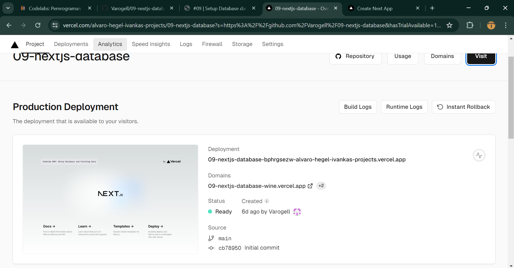
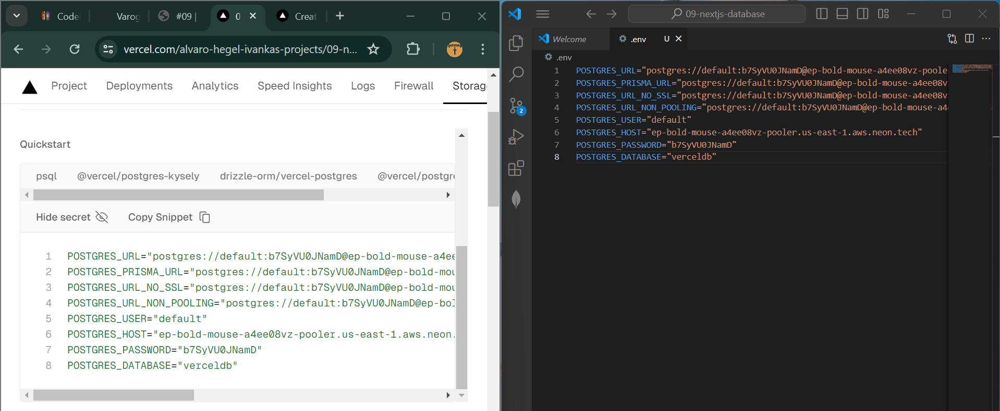
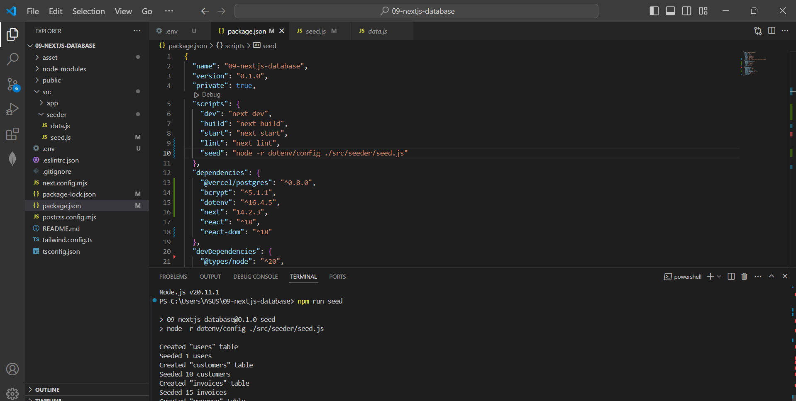
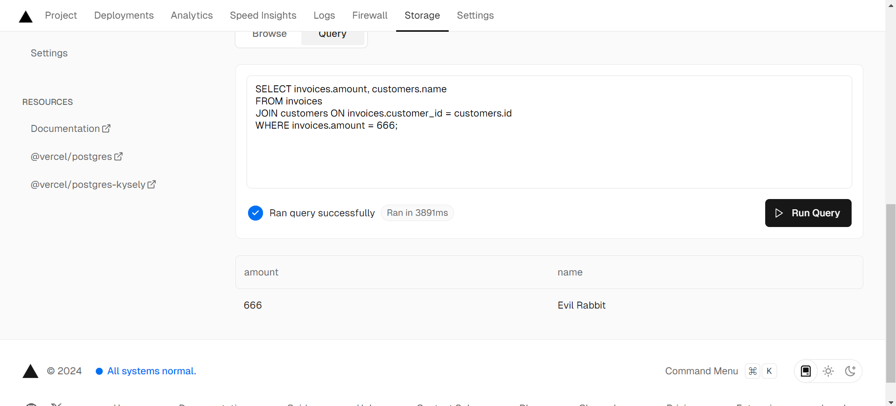
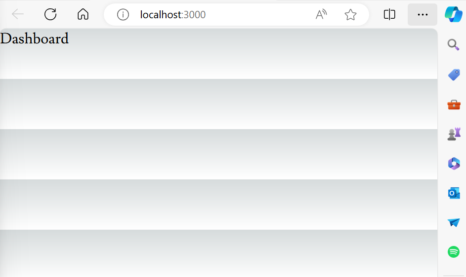
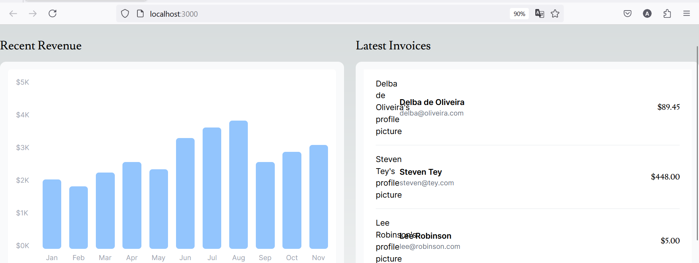
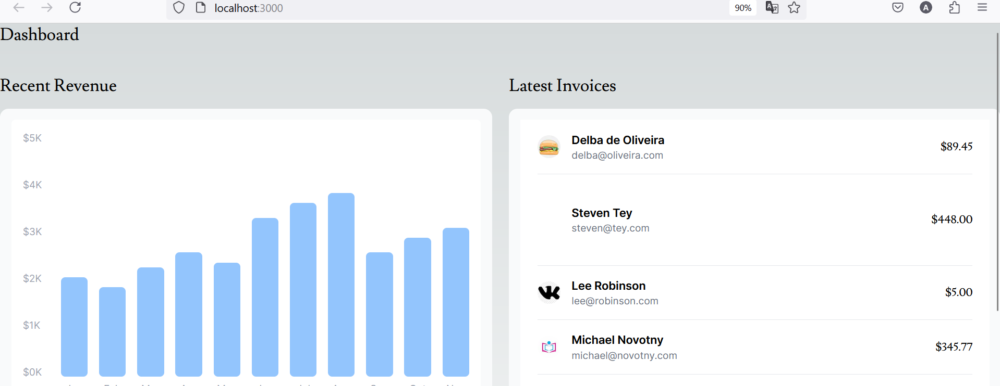
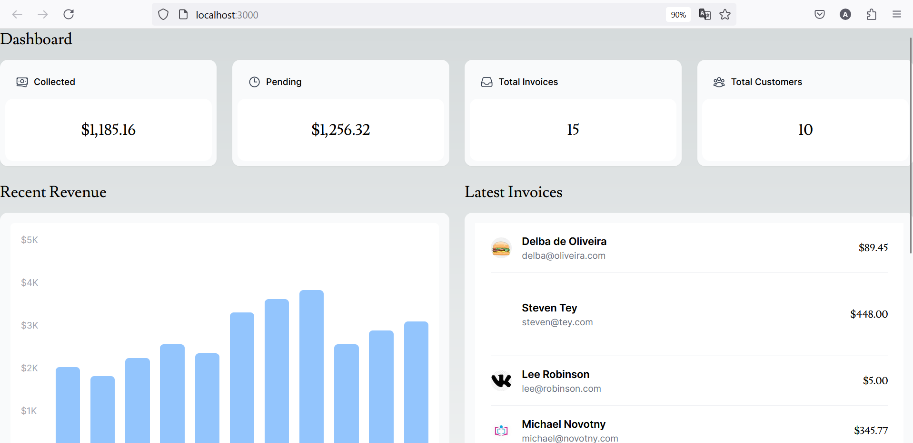

This is a [Next.js](https://nextjs.org/) project bootstrapped with [`create-next-app`](https://github.com/vercel/next.js/tree/canary/packages/create-next-app).

## Getting Started

First, run the development server:

```bash
npm run dev
# or
yarn dev
# or
pnpm dev
# or
bun dev
```

Open [http://localhost:3000](http://localhost:3000) with your browser to see the result.

You can start editing the page by modifying `app/page.tsx`. The page auto-updates as you edit the file.

This project uses [`next/font`](https://nextjs.org/docs/basic-features/font-optimization) to automatically optimize and load Inter, a custom Google Font.

## Laporan Praktikum

|  | Pemrograman Berbasis Framework 2024 |
|--|--|
| NIM |  2141720237|
| Nama |  Alvaro Hegel Ivanka |
| Kelas | TI - 3A |


### Praktikum 1

#### Soal 1



melakukan deploy github diserver vercel

#### Soal 2



membuat basisdata di vercel

#### soal 3



melakukan pembuatan database dan mengisi tabel dari file src.seeder/data.js

#### soal 4



melakukan query pada tab query

#### soal 5



Hanya menampilkan tulisan dashboard

##### soal 6



menampilkan grafik 

##### soal 7



menampilkan grafik 

##### tugas praktikum



fetchCardData() digunakan untuk mengambil data detail dari kartu berdasarkan ID yang diberikan melalui kueri GraphQL, dan mengembalikan data tersebut atau menangani error jika terjadi masalah selama pengambilan data.


